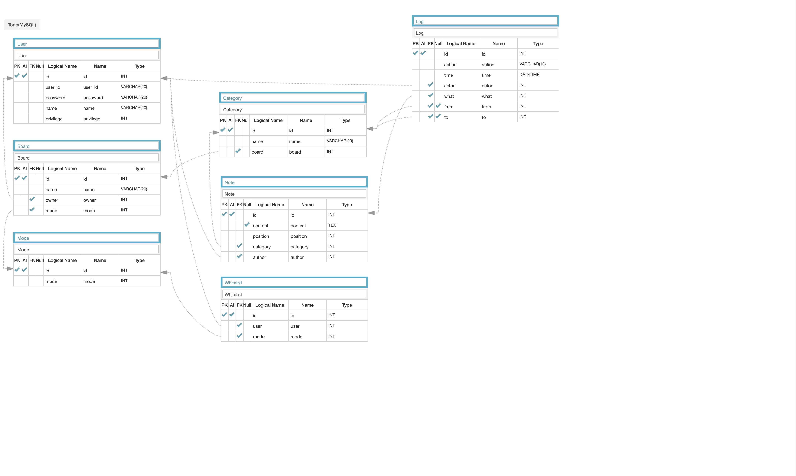

<h1 align="center">Welcome to membership-todo 👋</h1>
<p>
  
</p>

> boostcamp membership - mission 3 : Todo Wap App
### 🏠 [Homepage]()

## Structure
### Frontend
```
./
├── lib/                      # 구역 별 스타일 시트
├── public/                   # 정적 문서
├── src/                      # 소스 파일
|   ├── assets/               # 각종 소스
|   ├── components/           # 뷰에 들어갈 컴포넌트
|       ├── admin/            # 관리자 페이지용 컴포넌트
|       └── normal/           # 일반 사용자 페이지용 컴포넌트
|   ├── views/                # 페이지 레이아웃
|   ├── main.js               # 엔트리 포인트
|   └── router.js             # 라우터
├── tests/                    # 테스트용 
└── .env                      # 환경변수 설정파일
```

### Backend
```
./
├── bin/                      # Express 구동
├── cors/                     # CORS 관련 설정 파일
├── databases/                # 데이터베이스 관련 파일
|   ├── DDL/                  # DDL    
|   ├── models/               # 모델들    
|   ├── SQL/                  # SQL 
|   └── index.js              # DB API 엔트리 포인트
├── middlewares/              # 커스텀 미들웨어
├── public/                   # 정적 문서
|   ├── images/               # 정적 이미지
|   ├── javascripts/          # 정적 자바스크립트
|   ├── stylesheets/          # 정적 스타일 시트
|   └── uploads/              # 업로드 파일 보관소
├── routes/                   # 라우트
|   ├── adminRouter.js        # 인덱스 관련 라우트
|   ├── indexRouter.js        # 인덱스 관련 라우트
|   ├── itemRouer.js          # 유저 관련 라우트
|   └── userRlouter.js        # 유저 관련 라우트
├── session/                  # 세션 설정 파일
├── utils/                    # 커스텀 유틸리티
├── views/                    # 뷰 파일 (SSR은 아님)
├── .env                      # 설정 파일
├── app.js                    # 엔트리 포인트
└── db.json                   # 데이터베이스
```

## Design


## Skill & Dependency
### Backend
- Node.js
- Express
- cors
- crypto
- dotenv
- multer
- mysql2
- nodemon
- passport
- pm2
- redis
- uuid

### Frontend
- Vue.js
- vue-router
- fetch API

## Install

project/back
```sh
npm install
```

project/front
```sh
npm install
```

## Usage

project/back
```sh
npm run dev 
```

project/front
```sh
npm run serve
```

## Author

👤 **Einere**

* Github: [@Einere](https://github.com/Einere)
* Tistory: [Einere](https://kjwsx23.tistory.com)

## 🤝 Contributing

Contributions, issues and feature requests are welcome!<br />Feel free to check [issues page](https://github.com/Einere/membership-todo/issues).

## Show your support

Give a ⭐️ if this project helped you!

***
_This README was generated with ❤️ by [readme-md-generator](https://github.com/kefranabg/readme-md-generator)_